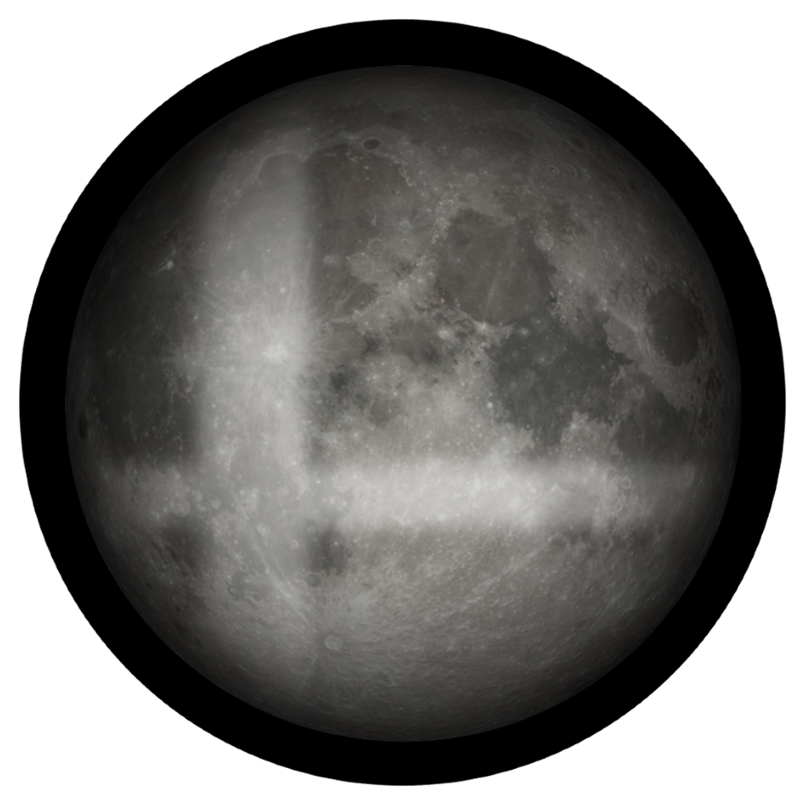

<div align="center">



# Lunar Clipper

**Search millions of Slippi replays. Turn the best moments into video.**

A desktop app that imports your [Slippi](https://slippi.gg/) replay collection (Super Smash Bros. Melee),
lets you hunt through it for exactly the moments you care about — a specific combo, a
zero-to-death, an edgeguard — and renders them out as high-quality clips.

[](https://github.com/madenney/lm-clipper/releases)
[](https://github.com/madenney/lm-clipper/releases)
[](LICENSE)
[](https://discord.gg/8SC3yuFjH)
[](https://www.youtube.com/@lunar_melee)

[**Website**](https://lunarmelee.com) · [**Download**](https://github.com/madenney/lm-clipper/releases) · [**Discord**](https://discord.gg/8SC3yuFjH) · [**YouTube**](https://www.youtube.com/@lunar_melee)

</div>

---

## What it does

Point it at a folder of `.slp` files — a few hundred, or a few million — and build a
**filter chain** to narrow them down. Each filter feeds the next, so you can go from
"every replay I own" to "every Falcon knee that killed off the top on Battlefield"
and export the result as video.

- **Import** `.slp` / `.slpz` replays in bulk, or drag a whole folder in
- **Filter** by game metadata — characters, stages, players, connect codes, dates
- **Find combos** with a combo parser: character-specific sequences (Falcon stomp → knee,
  Fox upthrow → upair), minimum hits, damage, kill confirms
- **Find edgeguards** with a dedicated parser that reconstructs the whole sequence —
  the launching hit, the recovery attempts, the denial — and scores how good it was
- **Search frame data** directly: action states, positions, stage zones
- **Write your own filter** in JavaScript if the built-ins don't cover it
- **Render video** via Slippi Dolphin's frame-by-frame dump + ffmpeg, at whatever
  resolution your hardware can take, with multiple Dolphin instances in parallel

It's backed by SQLite, so filtering stays fast across very large collections
(the author's own database is ~2.8 million games).

## Download

Grab the latest build from the [**Releases**](https://github.com/madenney/lm-clipper/releases) page.

| Platform | File |
| --- | --- |
| Windows | `Lunar-Clipper-Setup-<version>.exe` |
| Linux | `Lunar-Clipper-<version>.AppImage` |

The app updates itself — once installed, new releases are downloaded and applied in place.

> **Note:** builds are currently unsigned, so Windows SmartScreen will show an
> "unknown publisher" warning on first install. Click **More info → Run anyway**.
> ([Code signing](RELEASING.md#code-signing) is on the roadmap.)

## Requirements

- [Slippi Dolphin](https://slippi.gg/netplay) (the playback build) installed and configured
- A Melee ISO (NTSC 1.02)

## Community

Lunar Clipper is built around a community of Melee players and content creators.

- 💬 **[Discord](https://discord.gg/8SC3yuFjH)** — help, feature requests, and a `#videos`
  channel where people post what they've made with it
- 📺 **[YouTube](https://www.youtube.com/@lunar_melee)** — demos and clip compilations
  produced with the app
- 🌐 **[lunarmelee.com](https://lunarmelee.com)** — the project site, and a public archive
  of Slippi replays to search through

Bug reports and feature requests are welcome in
[Issues](https://github.com/madenney/lm-clipper/issues).

## Build from source

```bash
git clone https://github.com/madenney/lm-clipper.git
cd lm-clipper
npm install
npm run start
```

Production build:

```bash
npm run build
```

Package installers locally (without publishing):

```bash
npx electron-builder --linux --win
```

Distribution builds are produced by GitHub Actions when a `v*` tag is pushed.
See [RELEASING.md](RELEASING.md) for the release + auto-update process, and
[CONTRIBUTING.md](CONTRIBUTING.md) for development setup and coding standards.

## Contributing

Contributions are welcome — see [CONTRIBUTING.md](CONTRIBUTING.md).

## Acknowledgments

- [slp-to-video](https://github.com/kevinsung/slp-to-video) — the foundation for Slippi replay → video conversion
- [slippi-js](https://github.com/project-slippi/slippi-js) — replay parsing
- [libmelee](https://github.com/altf4/libmelee) — stage geometry constants used by the edgeguard parser
- [electron-react-boilerplate](https://github.com/electron-react-boilerplate/electron-react-boilerplate) — project template
- [Slippi](https://slippi.gg/) — replay recording and Dolphin integration for Melee

## License

GNU General Public License v3.0 — see [LICENSE](LICENSE).
